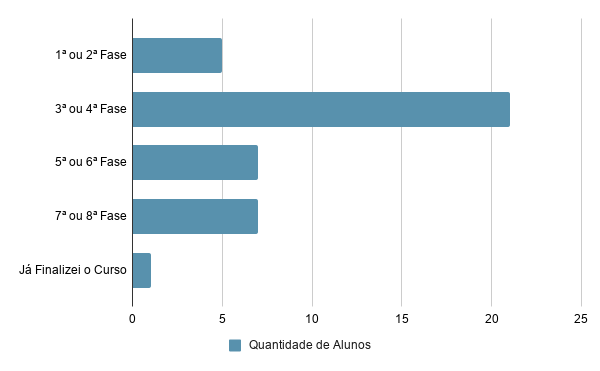
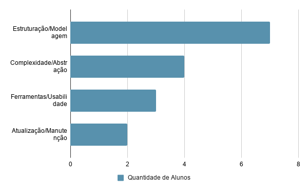

# 1.2 Origem da Demanda e Evidências
 
Como forma de validar a proposta do projeto, foi realizada uma pesquisa com alunos e professores do **Centro Universitário Católica de Santa Catarina – Joinville**, com o intuito de compreender as dificuldades associadas ao tema central do projeto — diagramação em padrão C4 — para que a definição de requisitos e métricas da ferramenta fosse mais alinhada às necessidades reais dos usuários.
 
## Metodologia
 
A pesquisa foi conduzida por meio de um **questionário estruturado**, aplicado a **42 usuários**. O perfil dos respondentes apresentou grande predominância de alunos nas fases intermediárias do curso — entre a 3ª e a 6ª fase.
 

*Figura 1 — Distribuição entre as Fases do Curso dos usuários que responderam ao formulário*
 
## Principais Dificuldades Identificadas
 
Analisando as respostas e os dados obtidos, observa-se que **a falta de entendimento do modelo** e **a dificuldade em encontrar ferramentas intuitivas** se destacam como as principais dores dos usuários.
 

*Figura 2 — Distribuição das Dificuldades mencionadas pelos usuários, categorizadas*
 
### Relatos dos Participantes
 
Além dos dados quantitativos, as respostas descritivas permitiram compreender de forma mais aprofundada como esses desafios se manifestam na prática.
 
**Sobre estruturação da modelagem:**
> *"Pensar na estrutura da modelagem, como conseguir organizar e interligar todos os componentes corretamente."*
 
Essa colocação evidencia a complexidade envolvida na definição e no relacionamento dos elementos arquiteturais.
 
**Sobre nível de detalhamento e evolução dos diagramas:**
> *"Detalhar na medida correta, e adaptar o diagrama para ficar atualizado em conjunto com o código."*
 
**Sobre as ferramentas disponíveis:**
> *"Ferramentas que não atendem as necessidades para criação do diagrama, ou que não são intuitivas e preciso investir muito tempo na aprendizagem do sistema primeiro."*
 
Essa percepção reforça a necessidade de soluções mais acessíveis e orientadas ao usuário, justificando a proposta apresentada neste trabalho.
 
---
 
[← 1.1 Contextualização](1.1-contextualizacao-e-problema.md) | [Sumário](../sumario.md) | [Próximo: 1.3 Análise de Soluções →](1.3-analise-de-solucoes-existentes.md)