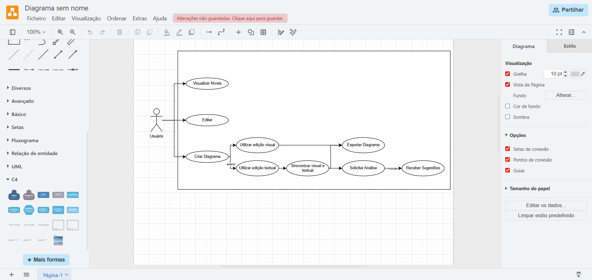
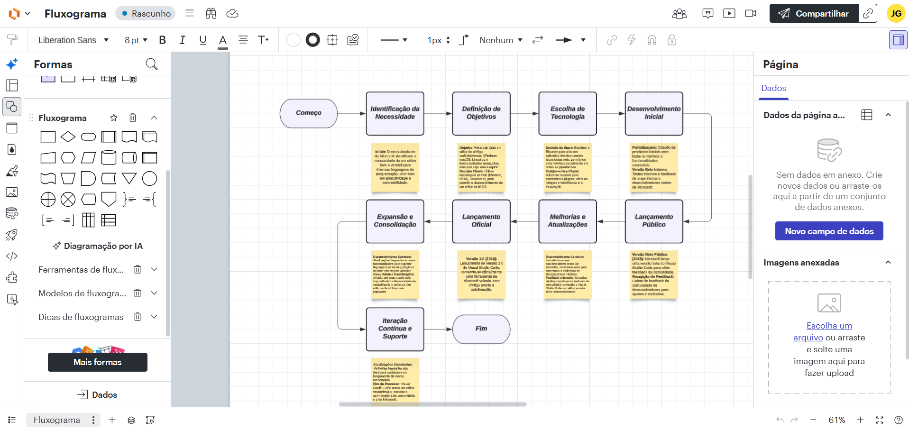
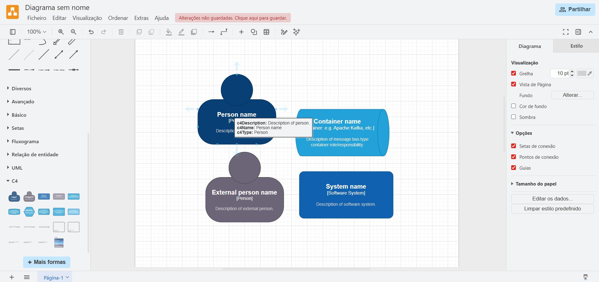

# 1.3 Análise de Soluções Existentes
 
Com base na pesquisa realizada, foram identificadas como principais ferramentas utilizadas para diagramação as plataformas **Draw.io**, **Lucidchart** e **diagrams.net**. A seguir, apresenta-se uma análise individual dessas soluções, considerando seu público-alvo, funcionalidades e limitações.
 
---
 
## Draw.io
 
🔗 [draw.io](https://draw.io)
 
**Público-alvo:** Desenvolvedores, estudantes e profissionais que necessitam criar diagramas de forma rápida e gratuita.
 
**Funcionalidades principais:**
- Criação de diversos tipos de diagramas (fluxogramas, UML, arquiteturais, etc.)
- Interface baseada em arrastar e soltar
- Integração com serviços de armazenamento em nuvem
- Uso gratuito e acessível
**Limitações:**
- Não possui suporte específico ao modelo C4
- Ausência de validação ou orientação durante a modelagem
- Dependência do conhecimento prévio do usuário
- Pode se tornar desorganizado em diagramas complexos

*Figura 3 — Interface do Draw.io*
 
---
 
## Lucidchart
 
🔗 [lucidchart.com](https://lucidchart.com)
 
**Público-alvo:** Equipes profissionais e usuários que necessitam de colaboração em tempo real.
 
**Funcionalidades principais:**
- Interface moderna e intuitiva
- Colaboração simultânea entre usuários
- Templates prontos para diferentes tipos de diagramas
- Integração com ferramentas corporativas
**Limitações:**
- Versão gratuita limitada
- Falta de orientação conceitual durante a modelagem

*Figura 4 — Interface do Lucidchart*
 
---
 
## diagrams.net
 
🔗 [diagrams.net](https://diagrams.net)
 
**Público-alvo:** Usuários que buscam uma solução gratuita e acessível para criação de diagramas online.
 
**Funcionalidades principais:**
- Plataforma gratuita baseada na web
- Interface semelhante ao Draw.io
- Criação de diversos tipos de diagramas
- Armazenamento local ou em nuvem
**Limitações:**
- Não oferece validação ou sugestões durante a modelagem
- Interface limitada para projetos mais complexos
- Dependência do conhecimento do usuário

*Figura 5 — Interface do diagrams.net*
 
---
 
## Conclusão da Análise
 
Após a análise das ferramentas apresentadas, observa-se que a principal lacuna a ser preenchida **não está na ausência de ferramentas de diagramação para o modelo C4**, mas sim na **falta de soluções que auxiliem e tornem mais eficiente o processo de criação e organização da estrutura dos diagramas**.
 
Os resultados da pesquisa corroboram essa visão: apesar da existência de ferramentas consolidadas, as dificuldades enfrentadas pelos usuários ainda são frequentes. Isso indica que o problema não está na disponibilidade de ferramentas, mas na **ausência de suporte durante o processo de modelagem arquitetural**.
 
As ferramentas analisadas podem ser consideradas **passivas** — limitam-se à representação visual, sem contribuir ativamente para a qualidade e consistência da modelagem. Nenhuma delas oferece:
- Mecanismos de orientação conceitual
- Assistência durante a construção
- Validação estrutural baseada no modelo C4
Diante disso, o presente projeto propõe o desenvolvimento de uma ferramenta com foco em **estudantes e desenvolvedores com menor experiência em modelagem arquitetural**. Seu diferencial está em não se limitar à criação de diagramas, mas em incorporar **assistência inteligente baseada em inteligência artificial**, capaz de orientar o usuário desde a definição inicial do escopo do sistema até a revisão e melhoria dos diagramas produzidos — algo não oferecido por nenhuma das ferramentas analisadas.
 
---
 
[← 1.2 Origem da Demanda](1.2-origem-da-demanda-e-evidencias.md) | [Sumário](../sumario.md) | [Próximo: 1.4 Público-Alvo →](1.4-publico-alvo.md)