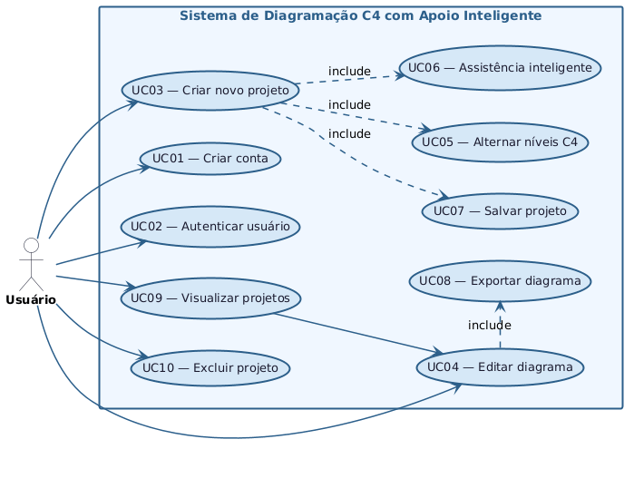

# 2.2 Casos de Uso Principais
 
Esta seção apresenta os principais fluxos de interação entre o usuário e o sistema, descrevendo as funcionalidades centrais da aplicação a partir das ações realizadas pelos usuários.
 
## Diagrama de Casos de Uso
 

*Figura 6 — Diagrama de Casos de Uso do sistema*
 
O sistema possui como ator principal o **usuário**, que interage com funcionalidades relacionadas à criação, edição e gerenciamento de diagramas no padrão C4. Destacam-se os casos de uso de criação de projetos, edição de diagramas e utilização de assistência inteligente, que representam o núcleo funcional da aplicação.
 
---
 
## Casos de Uso
 
| ID | Nome | Descrição |
|----|------|-----------|
| UC01 | Criar conta | Permite que o usuário realize seu cadastro na plataforma, informando dados básicos para acesso ao sistema |
| UC02 | Autenticar usuário | Permite que o usuário acesse o sistema por meio de credenciais previamente cadastradas |
| UC03 | Criar novo projeto de diagrama | Permite que o usuário inicie um novo projeto de diagramação no padrão C4, definindo nome e descrição |
| UC04 | Editar diagrama | Permite que o usuário adicione, edite e remova elementos dentro do diagrama, utilizando recursos visuais e/ou textuais |
| UC05 | Alternar níveis do modelo C4 | Permite que o usuário navegue entre os diferentes níveis do modelo C4 (Contexto, Container, Componente e Código) dentro de um mesmo projeto |
| UC06 | Utilizar assistência inteligente | Permite que o usuário receba sugestões automáticas para criação e melhoria dos diagramas, com base em boas práticas do modelo C4 |
| UC07 | Salvar projeto | Permite que o usuário armazene o progresso do diagrama para edição futura |
| UC08 | Exportar diagrama | Permite que o usuário exporte o diagrama em formatos utilizáveis (como imagem ou PDF) |
| UC09 | Visualizar projetos | Permite que o usuário consulte a lista de projetos criados e acesse diagramas existentes |
| UC10 | Excluir projeto | Permite que o usuário remova projetos previamente criados |
 
---
 
[← 2.1 Personas](2.1-personas.md) | [Sumário](../sumario.md) | [Próximo: 2.3 Requisitos Funcionais →](2.3-requisitos-funcionais.md)
 