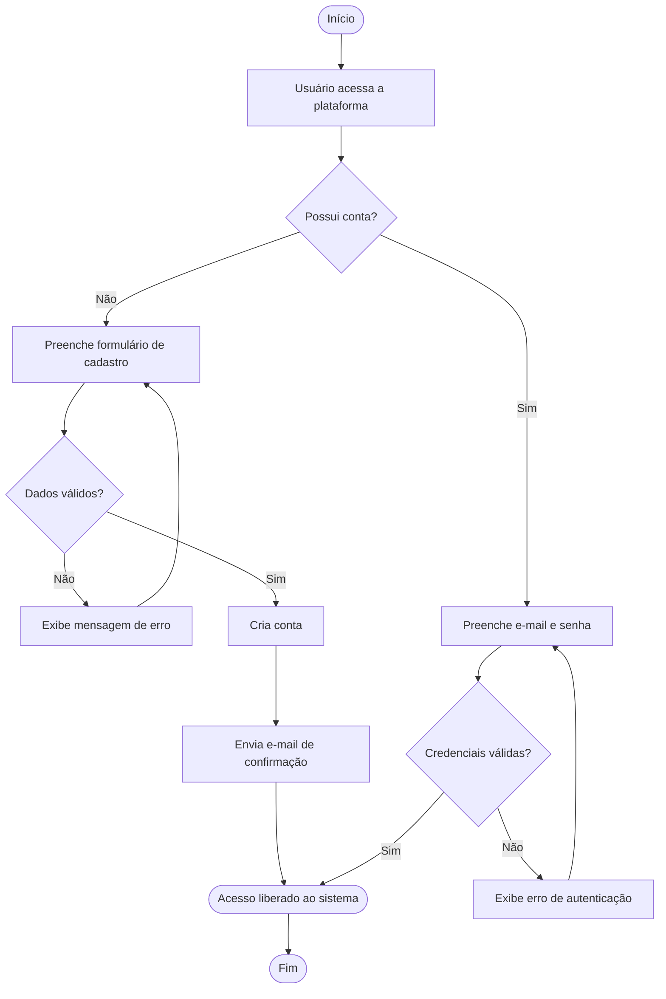
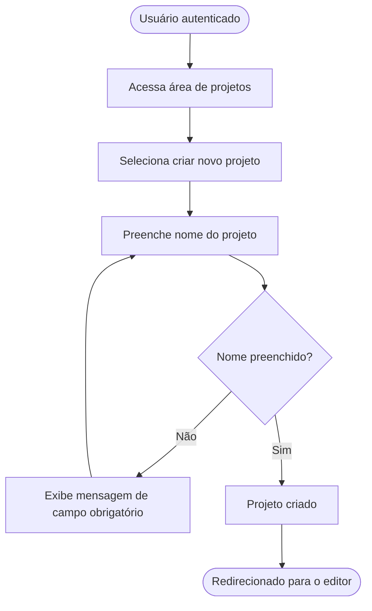
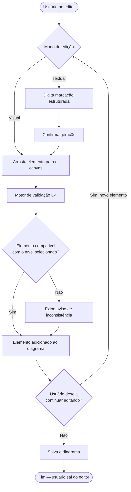
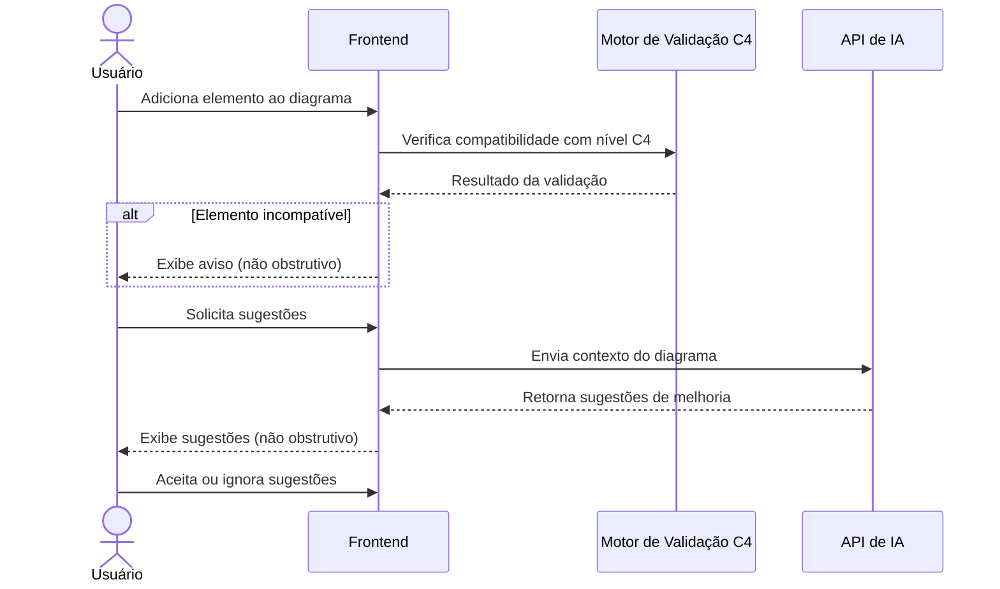
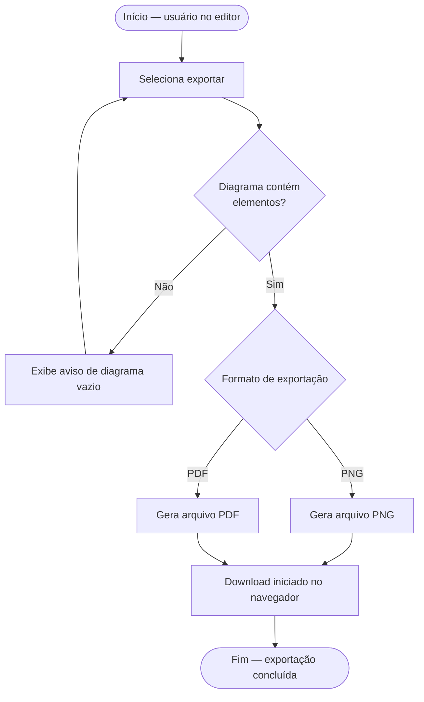
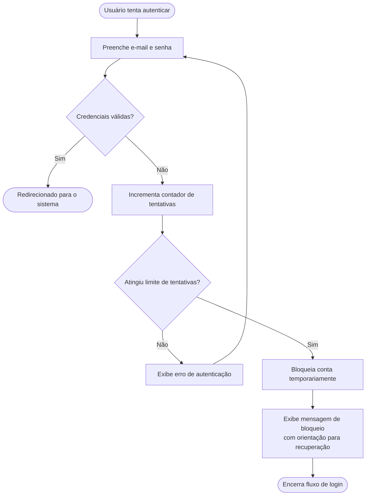
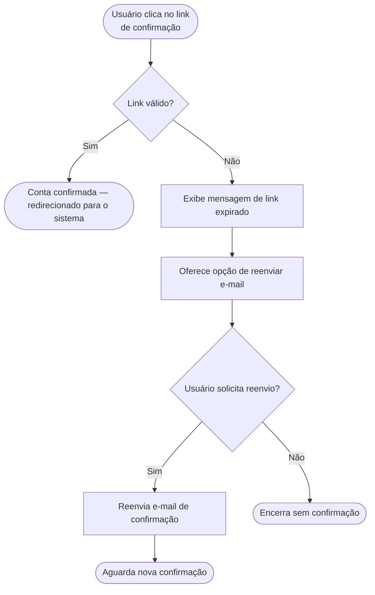
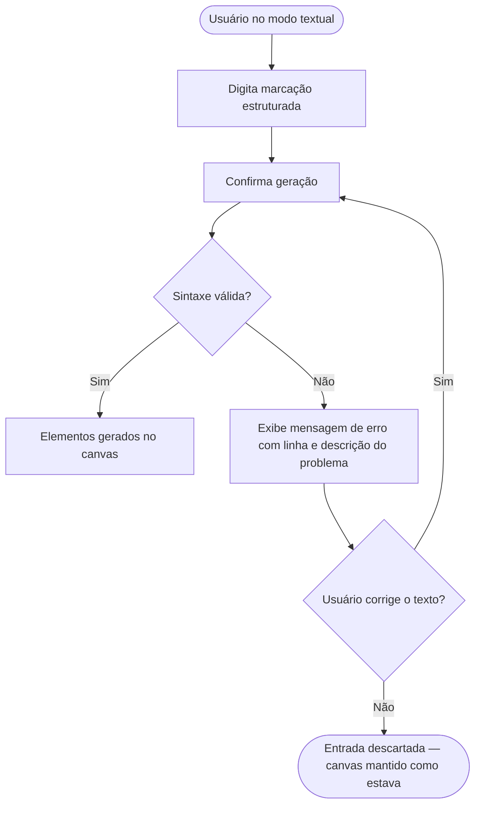
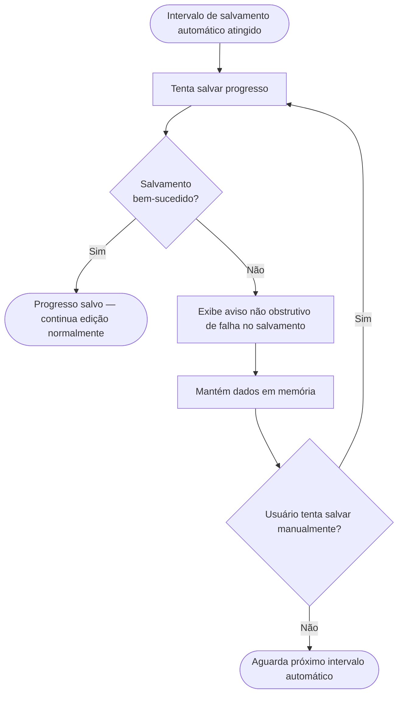
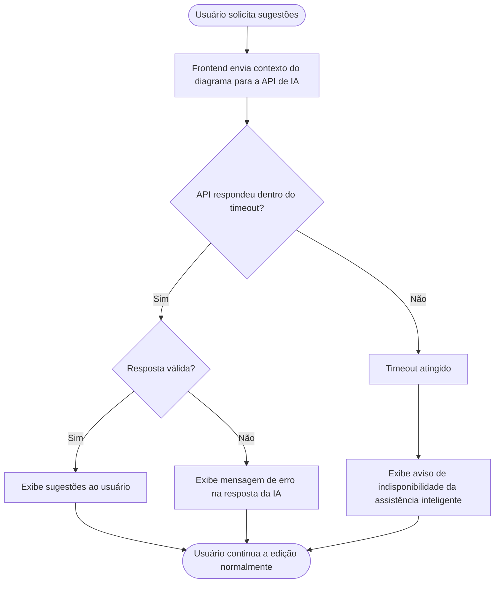

# 3. Fluxos e Comportamento do Sistema

Esta seção demonstra como o sistema funciona, descrevendo os principais fluxos de interação entre o usuário e a aplicação. Os diagramas a seguir representam o comportamento esperado do sistema em condições normais de uso, cobrindo desde o acesso à plataforma até a exportação dos diagramas produzidos. Fluxos alternativos, como erros e cancelamentos, são tratados na seção [3.2](#32-fluxos-alternativos).

---

## 3.1 Fluxo Principal do Usuário

### 3.1.1 Cadastro e Autenticação

Este fluxo cobre o acesso inicial à plataforma, contemplando tanto o cadastro de novos usuários quanto a autenticação de usuários já cadastrados. O sistema diferencia os dois caminhos a partir da existência de uma conta prévia, direcionando o usuário para o formulário adequado. Ambos os caminhos — cadastro e login — convergem para o mesmo ponto de acesso ao sistema, que representa o término do fluxo.

---

### 3.1.2 Criação de Projeto

Após autenticado, o usuário pode iniciar um novo projeto de diagramação. O projeto é a unidade principal de organização da ferramenta, agrupando os diferentes níveis do modelo C4 sob um mesmo contexto. O preenchimento do nome é obrigatório para que o projeto seja criado, conforme definido na [RN04](../capitulo-2/2.5-regras-de-negocio.md).

---

### 3.1.3 Edição do Diagrama

A edição é o fluxo central da aplicação. O usuário pode optar por dois modos de trabalho:

- **Edição visual** — baseada em drag & drop de elementos no canvas
- **Edição textual** — por meio de uma linguagem de marcação inspirada no PlantUML (texto → canvas)

Ambos os modos alimentam o mesmo motor de validação C4, que verifica a consistência da estrutura em tempo real sem bloquear o fluxo de trabalho do usuário, conforme definido na [RN11](../capitulo-2/2.5-regras-de-negocio.md). O ciclo de edição se repete a cada novo elemento adicionado, sendo encerrado quando o usuário decide salvar e sair do editor.

---

### 3.1.4 Assistência Inteligente

Este fluxo detalha a interação entre os diferentes módulos do sistema durante o uso da assistência inteligente. Ao adicionar um elemento ao diagrama, o frontend aciona o motor de validação, que verifica a compatibilidade do elemento com o nível C4 selecionado. Em paralelo, o motor de sugestões oferece orientações contextuais para aprimorar a estrutura. Ambos os retornos são exibidos ao usuário de forma **não obstrutiva**, preservando a liberdade de modelagem.

---

### 3.1.5 Exportação

Ao concluir a modelagem, o usuário pode exportar o diagrama nos formatos **PNG** ou **PDF**. O sistema verifica se o diagrama contém elementos antes de iniciar a geração do arquivo, evitando exportações vazias. Caso o diagrama esteja vazio, o usuário é informado e retorna à etapa de seleção de exportação — sem reiniciar o fluxo de edição. O download é iniciado diretamente no navegador após a geração.

---

## 3.2 Fluxos Alternativos

Esta seção descreve os comportamentos do sistema em situações fora do fluxo principal, contemplando erros, timeouts e cancelamentos. Os fluxos alternativos cobrem os cenários mais críticos da aplicação — autenticação, edição e assistência inteligente — garantindo que o usuário receba feedback adequado em qualquer situação.

---

### 3.2.1 Autenticação

#### Tentativas excessivas de login

Ao atingir o limite de tentativas com credenciais inválidas, o sistema bloqueia temporariamente o acesso para proteger a conta.

#### Link de confirmação de e-mail expirado

Ao tentar confirmar o cadastro com um link vencido, o sistema oferece reenvio sem exigir novo cadastro.

---

### 3.2.2 Edição

#### Erro de sintaxe na entrada textual

Ao submeter uma marcação com erro de sintaxe no modo textual, o sistema sinaliza o problema sem descartar o conteúdo digitado.

#### Falha no salvamento automático

Quando o salvamento automático falha, o sistema alerta o usuário sem interromper a edição, preservando o trabalho em memória.

---

### 3.2.3 Assistência Inteligente

#### API de IA indisponível ou timeout

Por ser uma dependência externa, a API de IA pode estar indisponível ou demorar além do esperado. O sistema lida com esse cenário de forma não obstrutiva, sem impedir o uso da ferramenta.

---

[← 2.6 Fora do Escopo](../capitulo-2/2.6-fora-do-escopo.md) | [← 3.1 Fluxo Principal](3.1-fluxos-e-comportamento.md) | [Próximo: Capítulo 4 →](../capitulo-4/4.1-fluxo-de-navegacao.md)