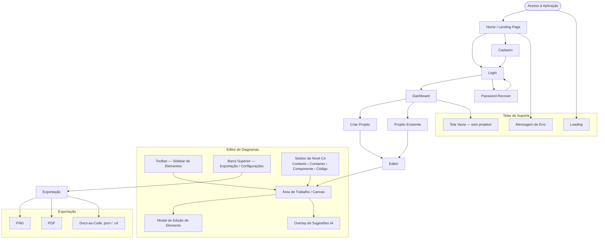

# 4. Mockups e Experiência do Usuário (UX)

Esta seção apresenta a visualização inicial da interface do produto antes da implementação, cobrindo o fluxo de navegação entre telas, os wireframes das principais interfaces e os fluxos de interação do usuário.
Os artefatos aqui apresentados foram desenvolvidos em baixa fidelidade, com foco na estrutura, organização e fluxo de uso — sem detalhar aspectos visuais finais como cores, tipografia ou ícones. Essa abordagem permite validar decisões de UX de forma ágil, antes de qualquer investimento em implementação.
A ferramenta utilizada para construção dos wireframes foi o Excalidraw, escolhida pela simplicidade, pelo estilo visual de rascunho adequado à baixa fidelidade e pela facilidade de exportação.

---

## 4.1 Fluxo de Navegação
 
Esta seção apresenta o mapa de navegação da aplicação, descrevendo como o usuário transita entre as telas do sistema. O fluxo foi organizado a partir da lista de páginas definida no planejamento de UX, cobrindo desde o acesso inicial até as funcionalidades principais.
 

 
---
 
[← Sumário](../sumario.md) | [Próximo: 4.2 Wireframes →](4.2-wireframes.md)