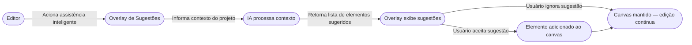
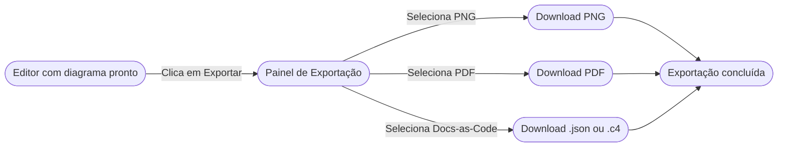
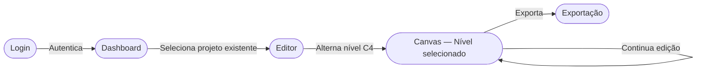

# 4.3 Fluxo de Interação do Usuário
 
Esta seção demonstra passo a passo os principais fluxos de interação da aplicação, conectando as telas apresentadas nos wireframes com as ações do usuário.
 
---
 
## Fluxo 1 — Primeiro Acesso e Criação de Diagrama
 
Fluxo completo de um novo usuário desde o acesso à plataforma até a criação do primeiro diagrama.

```mermaid
flowchart LR
    A([Home]) -->|Clica em Cadastrar| B([Cadastro])
    B -->|Preenche dados e confirma| C([Login])
    C -->|Autentica| D([Dashboard vazio])
    D -->|Clica em Criar Projeto| E([Modal Criar Projeto])
    E -->|Preenche nome e confirma| F([Editor])
    F -->|Seleciona nível C4| G([Canvas — Nível Contexto])
    G -->|Arrasta elemento da sidebar| H([Elemento no canvas])
    H -->|Clica no elemento| I([Modal de Edição])
    I -->|Preenche título e descrição| G
```
 

 
---
 
## Fluxo 2 — Uso da Assistência Inteligente
 
Fluxo de um usuário que utiliza a contextualização e o overlay de sugestões da IA para orientar a construção do diagrama.
 

 
---
 
## Fluxo 3 — Exportação do Diagrama
 
Fluxo de exportação após a conclusão da modelagem.
 

 
---
 
## Fluxo 4 — Retorno a Projeto Existente
 
Fluxo de um usuário que retorna à plataforma para continuar editando um projeto já criado.
 

 
---
 
[← 4.2 Wireframes](4.2-wireframes.md) | [Sumário](../sumario.md) | [Próximo: Capítulo 5 →](../capitulo-5/5.1-diagrama-c4.md)