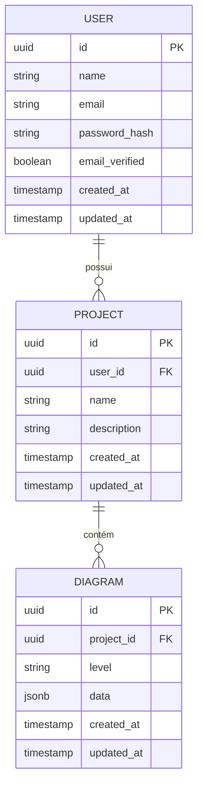

# 5.2 Modelo de Dados

Esta seção apresenta o modelo de dados do sistema, descrevendo as entidades principais, seus atributos e relacionamentos. A abordagem adotada é **híbrida**: dados estruturados e relacionais para usuários e projetos, e colunas `jsonb` no PostgreSQL para o estado dos diagramas — cujos elementos variam por nível C4 e não possuem schema fixo.

---

## 5.2.1 Diagrama Entidade-Relacionamento



---

## 5.2.2 Descrição das Entidades

### USER
Representa um usuário cadastrado na plataforma.

| Campo | Tipo | Descrição |
|-------|------|-----------|
| `id` | UUID | Identificador único |
| `name` | VARCHAR | Nome do usuário |
| `email` | VARCHAR | E-mail único, usado para autenticação |
| `password_hash` | VARCHAR | Senha armazenada com hash bcrypt |
| `email_verified` | BOOLEAN | Indica se o e-mail foi confirmado |
| `created_at` | TIMESTAMP | Data de criação |
| `updated_at` | TIMESTAMP | Data da última atualização |

---

### PROJECT
Representa um projeto de diagramação, que agrupa os diferentes níveis C4 de um mesmo sistema.

| Campo | Tipo | Descrição |
|-------|------|-----------|
| `id` | UUID | Identificador único |
| `user_id` | UUID | Referência ao usuário proprietário |
| `name` | VARCHAR | Nome do projeto (obrigatório) |
| `description` | TEXT | Descrição opcional do projeto |
| `created_at` | TIMESTAMP | Data de criação |
| `updated_at` | TIMESTAMP | Data da última atualização |

---

### DIAGRAM
Representa um diagrama vinculado a um projeto. Cada diagrama corresponde a exatamente um nível do modelo C4, conforme [RN07](../capitulo-2/2.5-regras-de-negocio.md).

| Campo | Tipo | Descrição |
|-------|------|-----------|
| `id` | UUID | Identificador único |
| `project_id` | UUID | Referência ao projeto pai |
| `level` | VARCHAR | Nível C4 suportado no MVP: `context`, `container` ou `component` |
| `data` | JSONB | Estado completo do diagrama — elementos, posições e conexões |
| `created_at` | TIMESTAMP | Data de criação |
| `updated_at` | TIMESTAMP | Data da última atualização |

> **Nota:** o campo `level` é armazenado como `VARCHAR` em vez de um tipo enumerado fixo, permitindo a futura adição do valor `code` (Nível 4) sem necessidade de migração estrutural da tabela, caso esse nível venha a ser implementado em uma versão futura do sistema (ver seção [2.6.4](../capitulo-2/2.6-fora-do-escopo.md)).

---

## 5.2.3 Estrutura do campo `data` (jsonb)

O campo `data` armazena o estado completo do diagrama como um documento JSON. Sua estrutura segue o formato do React Flow, facilitando a serialização e desserialização no frontend.

```json
{
  "nodes": [
    {
      "id": "node-1",
      "type": "c4-person",
      "position": { "x": 100, "y": 150 },
      "data": {
        "label": "Usuário",
        "description": "Estudante ou desenvolvedor"
      }
    },
    {
      "id": "node-2",
      "type": "c4-system",
      "position": { "x": 400, "y": 150 },
      "data": {
        "label": "C4Diagram",
        "description": "Aplicação web de diagramação"
      }
    }
  ],
  "edges": [
    {
      "id": "edge-1",
      "source": "node-1",
      "target": "node-2",
      "label": "Usa"
    }
  ]
}
```

---

[← 5.1 Diagrama C4](5.1-diagrama-c4.md) | [Sumário](../sumario.md) | [Próximo: 5.3 Principais Componentes →](5.3-principais-componentes.md)