# 9. Apêndices

## Apêndice A — Wireframes

Os wireframes a seguir foram desenvolvidos no Excalidraw e representam as telas principais do C4Diagrams em baixa fidelidade. As imagens estão disponíveis no diretório `/assets` do repositório do projeto.

### A.1 — Tela Home

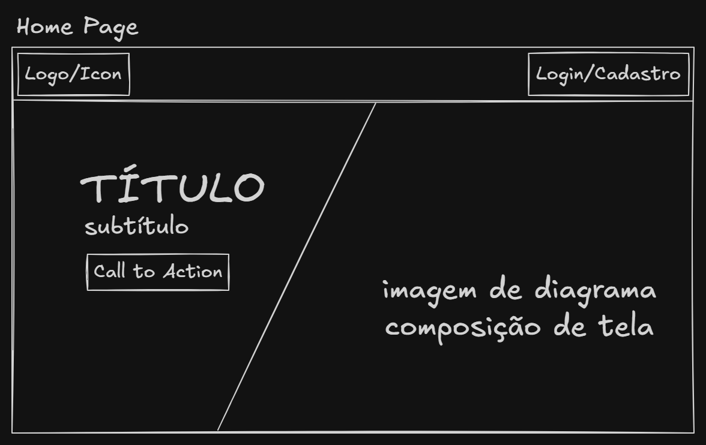

### A.2 — Tela de Login

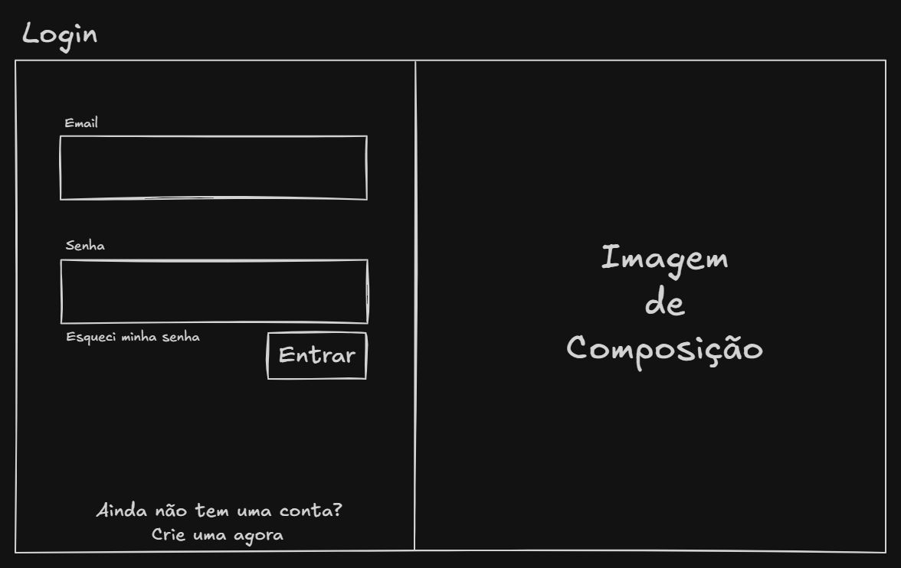

### A.3 — Tela de Cadastro

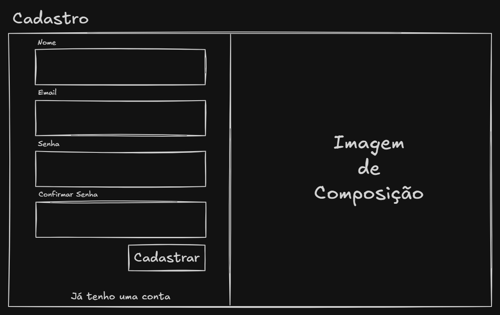

### A.4 — Dashboard de Projetos

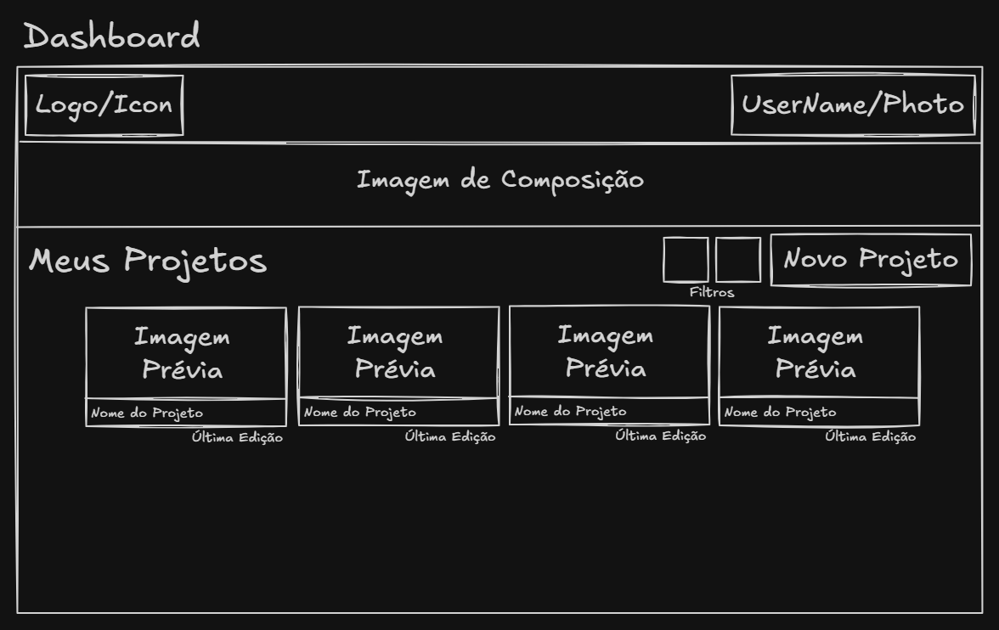

### A.5 — Dashboard Vazio (primeiro acesso)

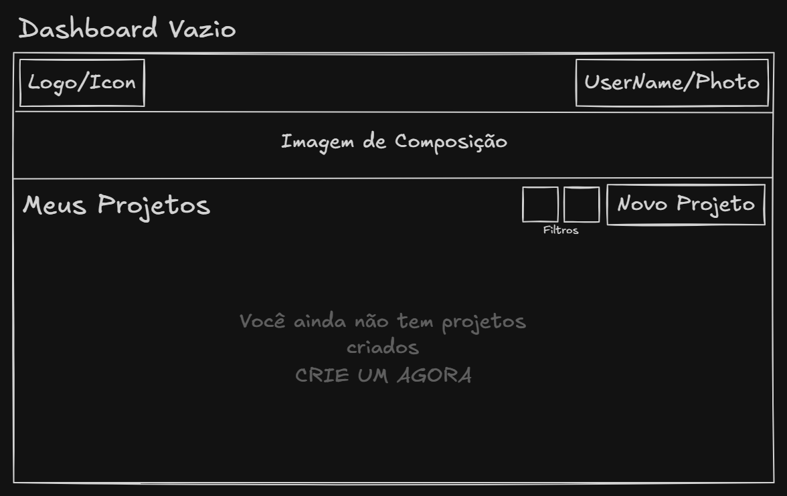

### A.6 — Criar Projeto

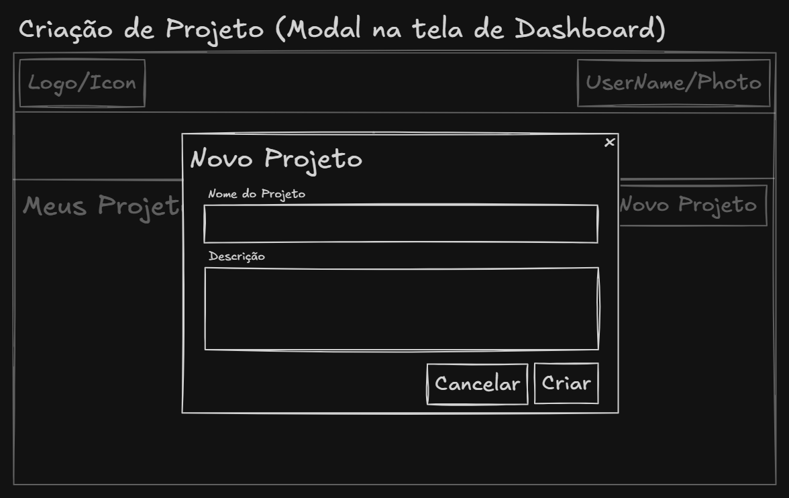

### A.7 — Editor Principal

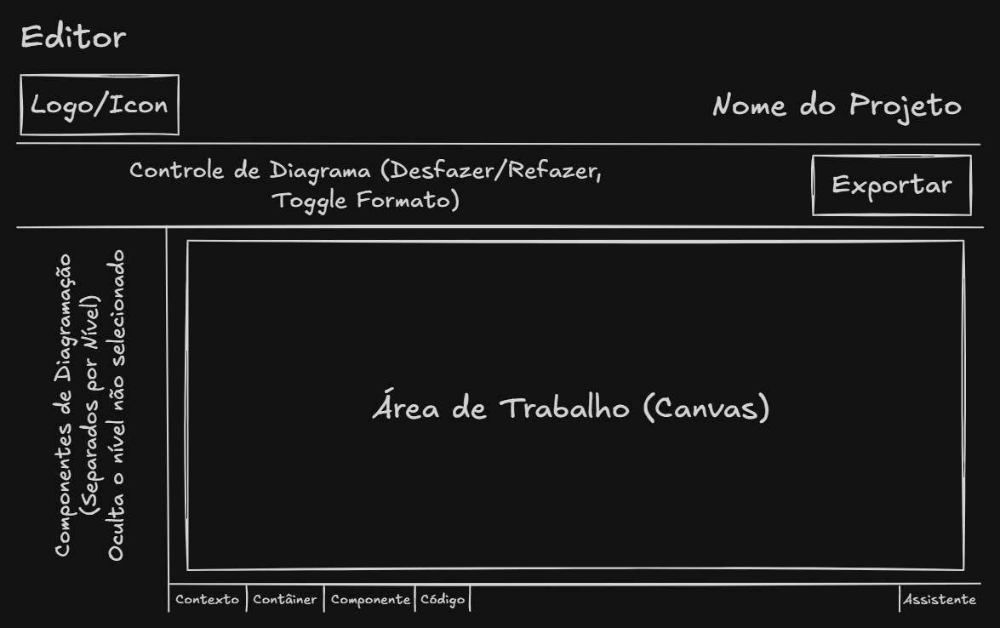

### A.8 — Modal de Edição de Elemento

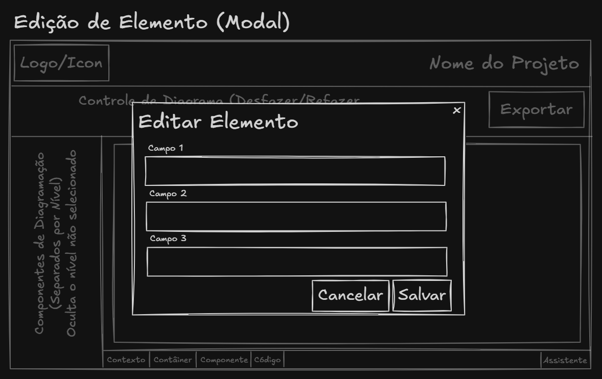

### A.9 — Overlay de Sugestões da IA

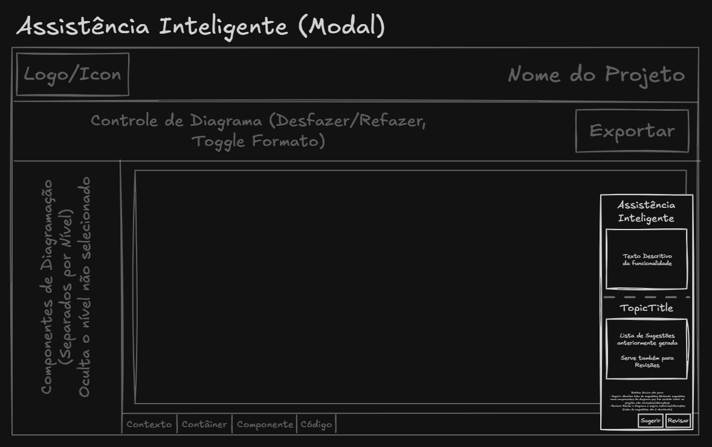

### A.10 — Exportação

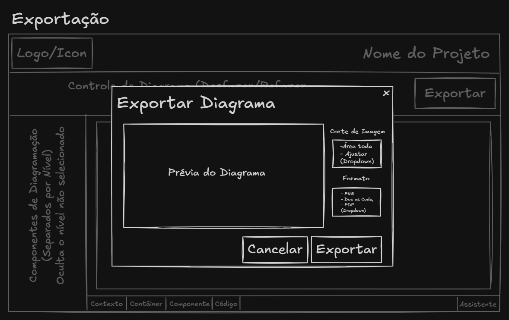

---

## Apêndice B — Figuras de Referência

Imagens utilizadas ao longo do documento para ilustrar a análise de mercado, pesquisa com usuários e diagramas de arquitetura do sistema.

### B.1 — Distribuição de Fases

### B.2 — Dificuldades Identificadas na Pesquisa

### B.3 — Interface Draw.io

### B.4 — Interface Lucidchart

### B.5 — Interface Diagrams.net

### B.6 — Casos de Uso

### B.7 — Diagrama de Contexto

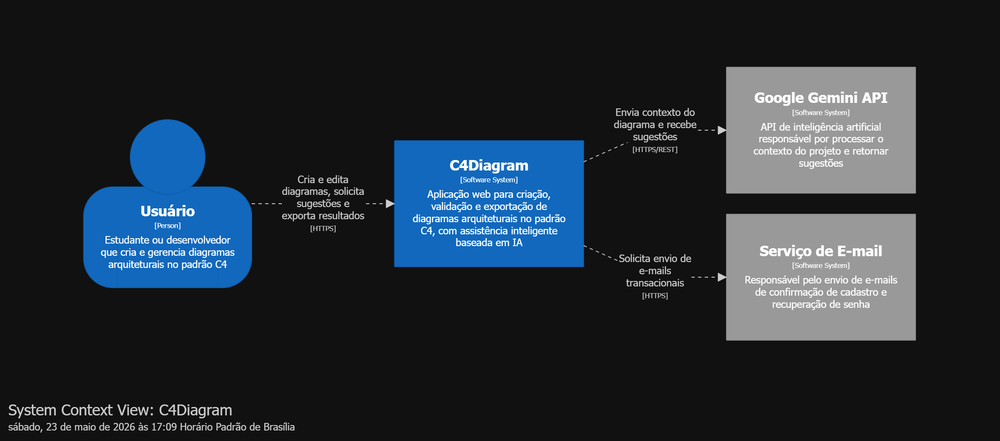

### B.8 — Diagrama de Containers

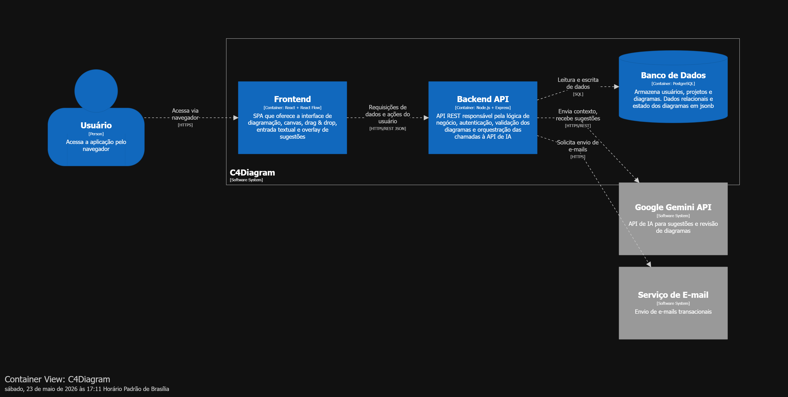

### B.9 — Diagrama de Componentes

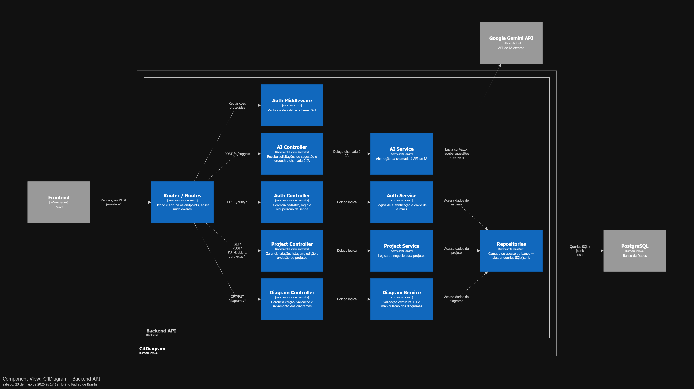

---

## Apêndice C — Resultados da Pesquisa com Usuários

A pesquisa de validação foi conduzida com **42 respondentes** entre estudantes de Ciência da Computação, Engenharia de Software e desenvolvedores juniores. O objetivo foi identificar as principais dificuldades no uso de ferramentas de diagramação existentes e validar a proposta do C4Diagrams.

- **Dados coletados (Google Sheets):** *[Planilha Google Sheets](https://docs.google.com/spreadsheets/d/19rNjJAb97cvF10-SjYnYq9oLniQVFkSfA3FO3uu18SA/view?usp=sharing)*

Os dados brutos estão disponíveis no link acima e não foram sumarizados neste documento. A análise qualitativa dos resultados foi utilizada como base para a definição das personas (seção 1) e para a priorização dos requisitos funcionais (seção 2).

---

## Apêndice D — Repositório e Protótipo

| Recurso | Link |
|---------|------|
| Repositório GitHub | https://github.com/JGTamanini/C4Diagrams |
| Protótipo / Deploy | *(a ser disponibilizado)* |

[← 8.1 Referências](../capitulo-8/8.1-referencias.md) | [Sumário](../sumario.md) | | [Próximo: 10.1 Avaliador 01 →](../capitulo-10/10.1-avaliador-1.md)